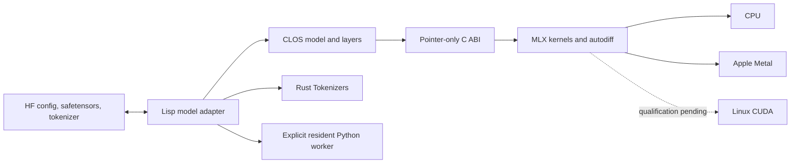

# Architecture and compatibility contract

The frontend keeps model computation in Common Lisp and delegates array operations and autodiff to MLX. Standard Hugging Face artifacts define interchange. This does not translate arbitrary Python programs into Lisp.

## Responsibilities

| File | Responsibility |
|---|---|
| `src/protocol.lisp` | Conditions, generic entry points, deterministic resource macro. |
| `src/mlx.lisp` | CFFI declarations, backend/tensor ownership, native operation wrappers. |
| `src/huggingface.lisp` | Configuration contract, canonical weight schema, checkpoint import/export, native Hub artifact bridge. |
| `src/llama.lisp` | Llama layers and shared mask/cache/inference contracts. |
| `src/portable.lisp` | Lisp-originated parallel-residual model, deterministic initialization, and custom Transformers package emission. |
| `src/components.lisp` | Public CLOS component descriptions, heterogeneous block composition, parameter schemas, native graph dispatch, construction snapshots, and `tb_composed` interchange. |
| `src/composition-import.lisp` | Validated Llama-to-component checkpoint conversion, borrowing native tensors for atomic export and preserving tokenizer/generation assets. |
| `src/qwen2.lisp` | Qwen2 configuration/schema contract and learned Q/K/V projection biases. |
| `src/gpt2.lisp` | GPT-2 layers, Conv1D layout, learned positions and legacy buffer validation. |
| `src/bert.lisp` | BERT masked-LM schema, bidirectional encoder graph and tied prediction head. |
| `src/generation.lisp` | Native tokenizer ownership, asset snapshots/attachment, batched text/pair preparation, and cached greedy generation. |
| `src/training.lisp` | Masked supervised loss and safe Lisp callback tracing through MLX autodiff. |
| `src/adapters.lisp` | LoRA projections, PEFT contracts, adapter ownership and merging. |
| `src/optimizers.lisp` | Transactional SGD/AdamW state, clipping, finite-update checks, and versioned native training checkpoints. |
| `src/python-worker.lisp` | Explicit model-level protocol and resident Python process ownership. |
| `scripts/hf-worker.py` | Transformers AutoClass execution, device selection and checkpoint export. |
| `python/tb_parallel/` | Versioned Python AutoConfig/AutoModel implementation emitted with portable checkpoints. |
| `python/tb_composed/` | Matching Python implementation of the supported component vocabulary, reusing emitted parallel-model numerical/protocol support. |
| `scripts/hf-artifacts.py` | One-shot native Hub snapshot and publication boundary; credentials remain in its environment. |
| `TB:INSPECT-PRETRAINED` | Configuration-only native compatibility report and explicit Python fallback route. |
| `TB:MODEL-CAPABILITIES` | Loaded native/Python backend, actual device/API, dtype, and operation report. |
| `native/mlx_bridge.c` | C-compatible pointer ABI around MLX C's by-value handles. No model architecture. |
| `native/tokenizer/` | Owned-pointer Rust ABI around Hugging Face Tokenizers. |

FP style keeps layer inputs/outputs explicit. CLOS methods specialize architecture configuration/schema rules, `compute-logits`, `project`, `apply-layer`, task-specific `prepare-training-batch`, architecture-specific `adapter-contract`, `named-parameters`, tensor access, and resource disposal. Decoder models select shifted next-token targets; BERT selects explicitly labeled positions without shifting. Adapter contracts constrain task metadata, target suffixes, and safe automatic model mappings for each architecture. The common `forward` path handles validated cache ownership. Macros generate repeated FFI declarations and bounded resource lifetimes. Parameter schemas centralize shape/name knowledge. Further adapters should add methods/schema rules and independent compatibility fixtures.

BERT token-type IDs travel as explicit batch arguments through `forward`, training, and `compute-logits` (its optional arguments are cache followed by a native token-type tensor). The `validate-token-type-ids` generic checks host arrays before device allocation; the default architecture method rejects supplied IDs. The autodiff callback binds the current batch's IDs for its synchronous invocation, and no segment state is retained in the model or optimizer.

## Semantics

Activations are `(B,T,D)`; attention tensors are `(B,H,T,Dh)`; Llama and Qwen2 linear weights retain Hugging Face `(out,in)` layout. Qwen2 specializes the generic projection function to add its learned query/key/value biases while reusing the exact common RMSNorm, SwiGLU, GQA and RoPE graph. GPT-2 Conv1D uses its original `(in,out)` layout, and its output head uses `(out,in)`. Attention scales by `1/sqrt(Dh)`, and normalizes over keys inside MLX SDPA. GQA preserves the configured query/KV head counts. RoPE uses the non-interleaved Llama/Qwen2 convention and absolute cache offsets. Explicit additive masks avoid ambiguous causal alignment when query and key lengths differ.

The initial mask contract supports right padding. Fully masked rows and left padding signal conditions. Every cached call must supply the complete key-validity mask if padding is used; cache masks are not inferred from previous calls. Cache entries belong to a model version and batch size; training invalidates them. Cache K/V storage grows in configurable blocks, is slice-updated transactionally, and exposes separate committed length and reserved capacity. Greedy generation uses native argmax and transfers only the selected token to Lisp.

Architecture-specific configuration validators admit explicit computational and informational fields. Unknown fields and unsupported variants are rejected for review. Safetensors imports check complete canonical name/shape coverage and reject extras or missing weights. Tied embedding/head weights are one canonical trainable parameter; duplicated serialized ties must agree exactly. BF16/FP16 weights are converted to FP32 for this first implementation; export records FP32 and preserves values after that conversion. Original low-precision storage dtype is not retained.

The tokenizer API exposes the native `tokenizer.json` pipeline, including its postprocessor when `:add-special-tokens` is true. It does not claim arbitrary Transformers tokenizer subclass logic, cleanup rules, chat rendering, or application-level prompt formatting. Verify each new tokenizer family against Python before advertising it.

## Ownership and execution

Tensors hold native MLX arrays, never Lisp scalar arrays in numerical hot paths. Intermediate tensors live in deterministic scopes; escaping results/cache entries retain independent MLX handles. Finalizers are a fallback for persistent objects; explicit disposal is preferred. Host copies first materialize row-major contiguity, because native views and gradients may be strided.

Each backend has a requested compute stream and a CPU I/O stream. Checkpoint loading remains a CPU operation even for GPU computation. Inference evaluates the graph before returning and before committing cache changes. Block-growing caches keep the previous committed tensors intact until evaluation succeeds, then replace them with evaluated slice-updated storage. Fixed-size and paged caches remain possible specializations.

The native loss closure calls Lisp synchronously on the tracing thread. All parameters are explicit differentiable arguments. Lisp conditions are caught inside the callback and re-signaled only after returning through C. No callback is retained after the gradient call. SGD/AdamW compute and evaluate parameter and state replacements before swapping the model's parameter table.

SBCL normally enables floating-point traps that C/C++ libraries expect masked. Generated FFI wrappers mask traps dynamically and restore caller modes. Do not disable the Lisp process's traps globally.

Large numerical work uses native matrix, normalization, RoPE, SDPA, loss, and cache slice-update kernels. Whole-model graph compilation, projection packing, fixed-size/paged KV caches, low precision, and quantization are not yet implemented. Native kernels alone are not a measured promise that the complete frontend matches every optimized C/Rust runtime.

## Explicit Python boundary

Unsupported native architectures can opt into `:execution :python`. This is a separate CLOS model type whose control requests cross a versioned JSON-lines protocol. Named forward calls may move tensor payloads through validated worker-owned binary files while JSON carries only metadata. An installed `AutoModel*` class can be selected by name; its tokenizer applies saved chat templates and its AutoProcessor can prepare text, numeric arrays, and local media files inside the worker. The worker keeps Torch weights, PEFT LoRA adapters, and optimizer state resident, redirects Python standard output away from protocol frames, reports its actual device, bounds forward-response size, and shuts down deterministically. It is never labeled native MLX execution. See [python-worker.md](python-worker.md) for the supported operation contract.

## Interchange boundaries still to implement

Non-LoRA PEFT methods, distributed execution, native advanced generation, native low-precision preservation, shared-memory/full-operation worker tensor transport, streamed export, and arbitrary new component/Python emission remain separate milestones. The existing `tb_parallel` and [composed-block](components.md) formats already emit reviewed matching implementations. Standard model, PEFT adapter, and resumable training-checkpoint exports are written to hidden sibling directories and exposed through one same-filesystem operation: rename for a new path, macOS `RENAME_SWAP` or Linux `RENAME_EXCHANGE` for replacement. The earlier directory is removed only after the exchange. This provides atomic visibility to path-based readers, but does not claim filesystem power-loss durability.
